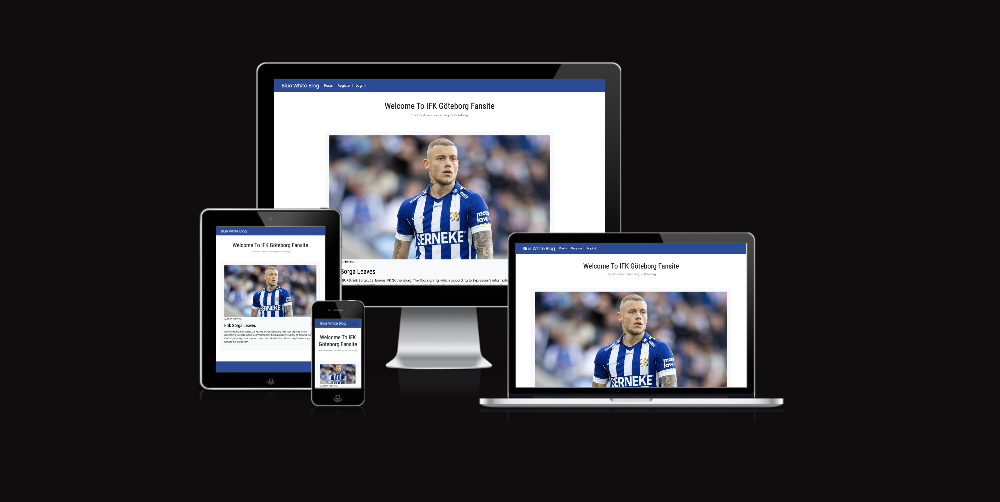
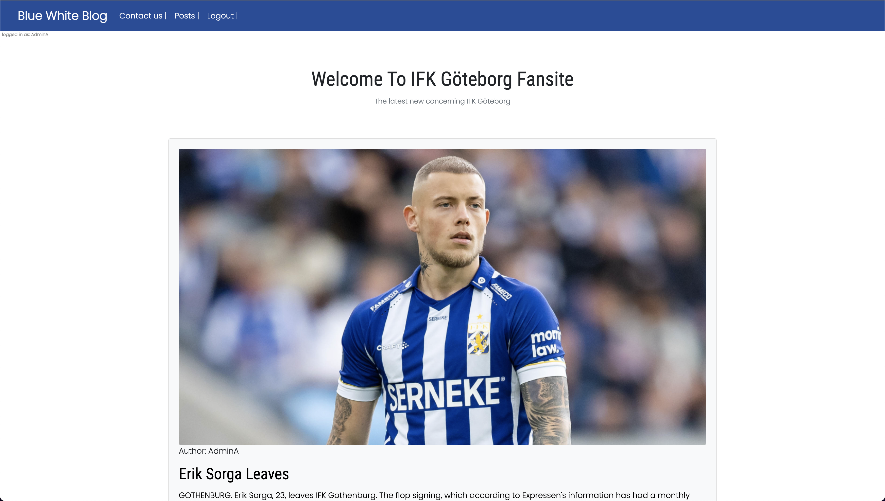
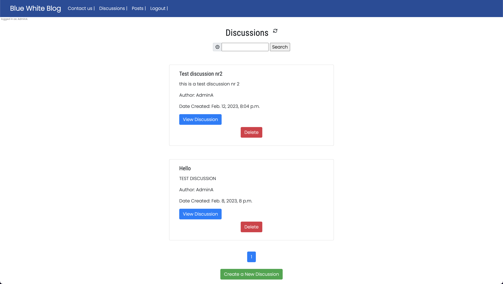
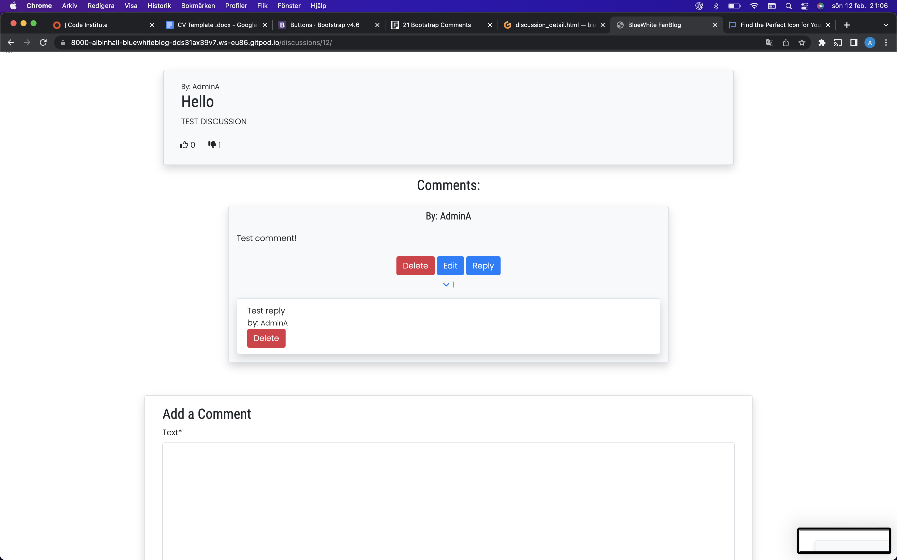
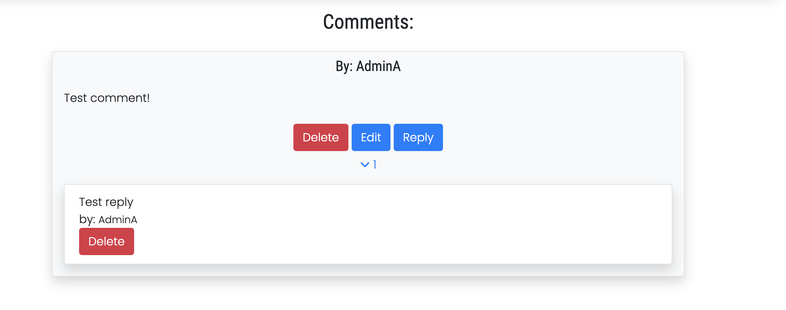
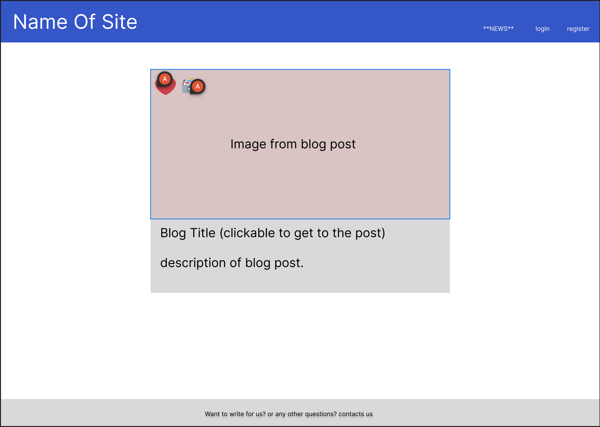
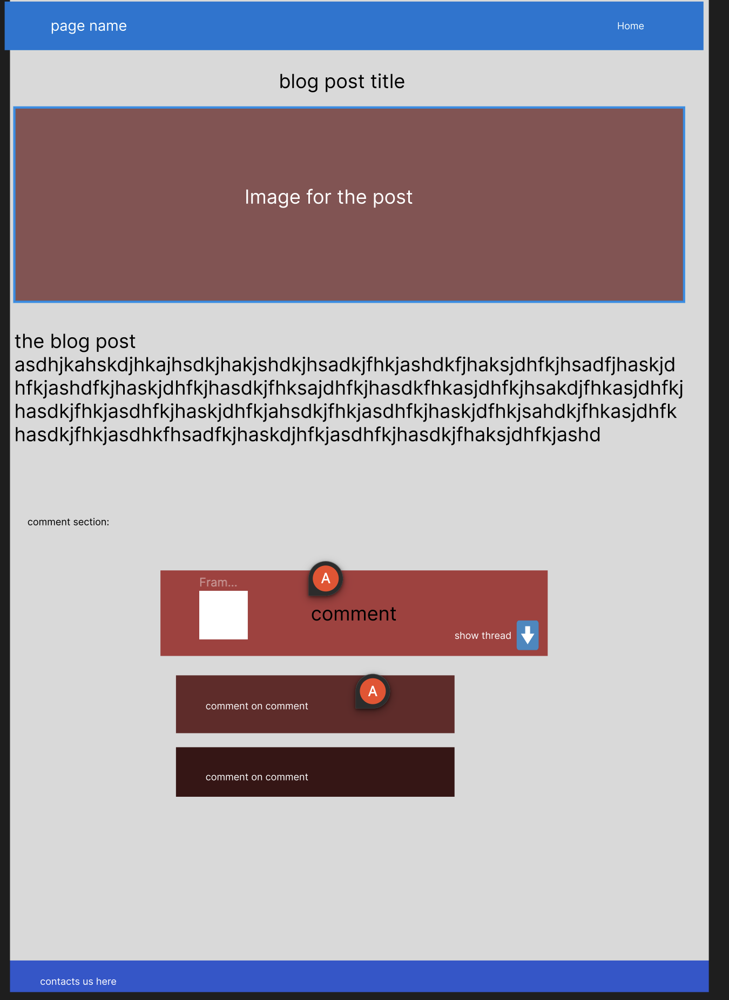

# Blue White FanBlog

Blue White FanBlog is a website for fans of the fotball club IFK Gothenburg. The site is simple but yet effective and design to give the fans quick and easy information written by admin and or the website crew. The Site Contains one main page that will display news and articles about whats going on in and outside the Club. The side gives the user an ability to login, read and comment the posts/news 

The site is built via github/django

## Features 

### Main page
- The main page contains of navbar with the ability to log in and a overview of the posts available
    - The site user can log in via google and github for smooth and easy login
- The blog posts are clickable and redirects the user to the post details.
    - The post details is the place where fans of the fotball club can read and commit the post
    - The comments are deleteable and editable for the creater of the comment
        - The comment section is a place for fans to express their feeling about the post
- The site user can send email to the owner of the page via a link in the foter
    - The site user may have some useful informationn about improvement of the site etc
    - the site user may want to be a writer of posts  
    - The email is only connected to mailtrap for testing as I dont want any mail to my adress

### Existing Features

- __The starting page nav__

  - The navbar is made with bootstrap class and contains links so the user can login/logout/register
    - For logged in users there will be an option to reach out to page owner via mail
    - The loggedin user will be able to se their name under the navbar

- __The scrollable post page__

  - The site user can scroll through all the different post that is available
    - Only loggedin users will be able to click in to the posts and comment/like

- __The Footer__

  - The footer will contain content for the logged in user
  - The footer will exand in height as the page content decreases to give the page more styling

- __Inside the post view__

  - This page will let authenticated users to comment/read/like the post. 

- __The comments__

  - Users will be able to create,delete,edit and view their comments for every post

- __The Login__

  - User will be able to create their own user with username and password
    - The user can choose to login via their github account

- __The email form__

  - User will be able to send email directly from the site

- __The Discussion list__

  - Users are able to create and engage in already created discussions
    - Search functionality for topics etc

- __The discussion detail__

  - Users are able to like and dislike discussions

- __The comment section__

  - Users are able to comment and reply to comments in a threaded manner

### Features Left to Implement

- More social account login providers

- Javascript function instead of page refresh for comments and like etc

- Like and dislike function for comments and comments replies in discussion_detail.html

## Testing 

The testing has been done manually both under the development process but also after the product was finnished developed

- __Manually testing that has been done__
  - Check so that users can't create accounts/send email without adding the correct information
  - Check so that the site users that is not authenticated can visist the blog posts
    - This has been made so that the un autherised site user can visit the first page but a modal will apear when clicking the posts
  - Check so that the site users that is not authenticated can't visist the discussion pages
    - This has been made so that the un autherised site user can visit the first page but a modal will apear when clicking the discussion link in the nav bar
  - Check so that only the creator of a discussion/comment/reply can edit/delete the comment
  - Check so that users only can like or dislike the discussion once
  - Check so that authenticated users can't change or delete comments they havent made them self
  - Check so that all the colors works well togheter and does not disturb the user
  - Check so that messages appear to the user when something has been deleted/created or when the user login/logout etc
  - Check so that the send email function works and dont allow harmful content or whitespace for name
  - Check so that the mobile version of the site works well and look good

- __Bugs__
  - Whitespace allowed for send email name (Fixed)
  - Like/dislike button not working for discussions (Fixed)
  

### Validator Testing 

- HTML
    - No errors were returned when passing through the official except for marks on using of '{}' [W3C validator](https://validator.w3.org/)
- CSS
    - No errors were found when passing through the official [(Jigsaw) validator](http://jigsaw.w3.org/css-validator/validator$link)
- JavaScript
    - javascript for delete warning tested and validated

### Unfixed Bugs

## Deployment

- The site was deployed to Heroku. The steps to deploy are as follows: 
  - First the project was started in gitpod
    - In gitpod I installed the absolute necissery packages and made an env.py file and a requirements.txt
  - In herkoku I created a new app and added The neccessary config vars such as:
    - the secret key, Database_url and the cloudinary_url (storage of image)
  - The Database was obtained from elephantsql and is hosted from Amazon server in Sweden
  - After the config vars where setup the site was now ready for deployment through heroku

The live link can be found here - https://code-institute-org.github.io/love-maths/

## Styling And Design
 - The styling was first done in a [Wireframe service provided by figma](https://www.figma.com/files/recent?fuid=1183067792205480494)

 

 

- The Discussion pages were not made in a wireframe but were copied in style from the rest of the site.
- The route I've taken with the design part is less is more, the whole blog is designed to be minimalistic and clean
- The use of bootstraps card is an important implementation of the blog because it displays the content in a clean and simple manner 
## Credits 

### Content 

- The text for the one available post was taken from [expressens news site](https://www.expressen.se/sport/fotboll/allsvenskan/erik-sorga-lamnar-ifk-goteborg-for-bulgarien/)
- Instructions on how to implement email function was taken from [Codie with stein](https://www.youtube.com/watch?v=dnhEnF7_RyM&ab_channel=CodeWithStein)
- Whitespace validation for the email form was taken from[stackoverflow](https://stackoverflow.com/questions/332102/what-is-the-best-way-to-catch-and-show-an-error-if-user-enters-only-whitespace-i)
- Update comment and delete comment view was inspired from[geeksforgeeks](https://www.geeksforgeeks.org/updateview-class-based-views-django/)
- overall help was taken from Tutors at code institute
- overall help and trouble shooting was taken from ChatGPT by [openai](https://openai.com/)
- The comment thread [CSS-tricks](https://css-tricks.com/styling-comment-threads/)
- Information and inpsiration from [Codemy](https://www.youtube.com/@Codemycom)
- The icons where taken from [Font Awesome](https://fontawesome.com/)
- The fonts where taken from [Google Fonts](https://fonts.google.com/about)
- Styling of page is made with [bootstrap](https://getbootstrap.com/)

### Media

- The placeholder image is taken from [picsum](https://picsum.photos/200)
- picture from blogpost is taken from [fotboll direkt](https://fotbolldirekt.se/2022/05/29/erik-sorga-om-att-ha-blivit-publikfavorit-i-ifk-goteborg-trots-att-han-knappt-spelat)
